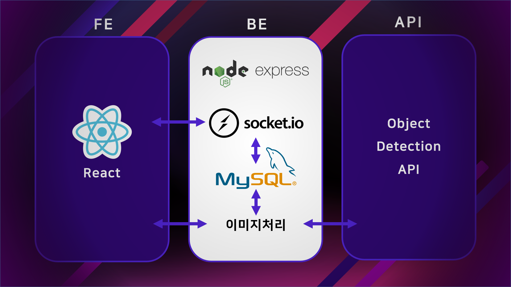
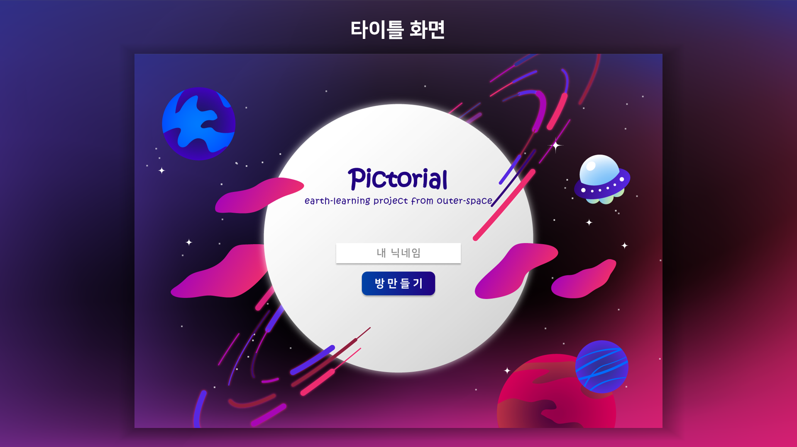
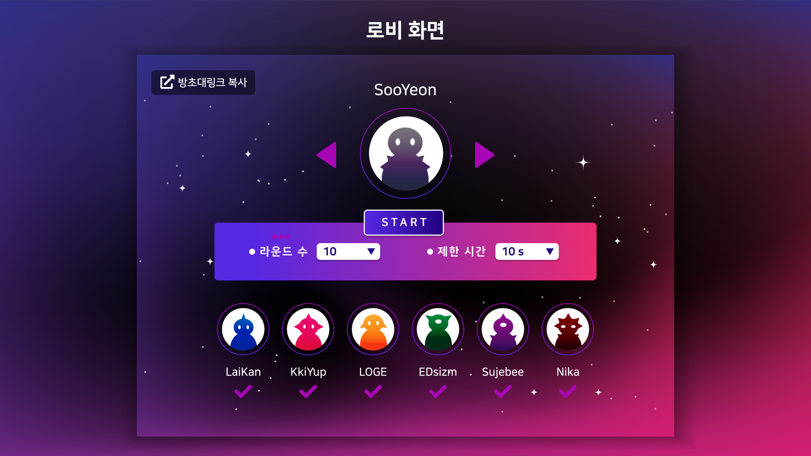
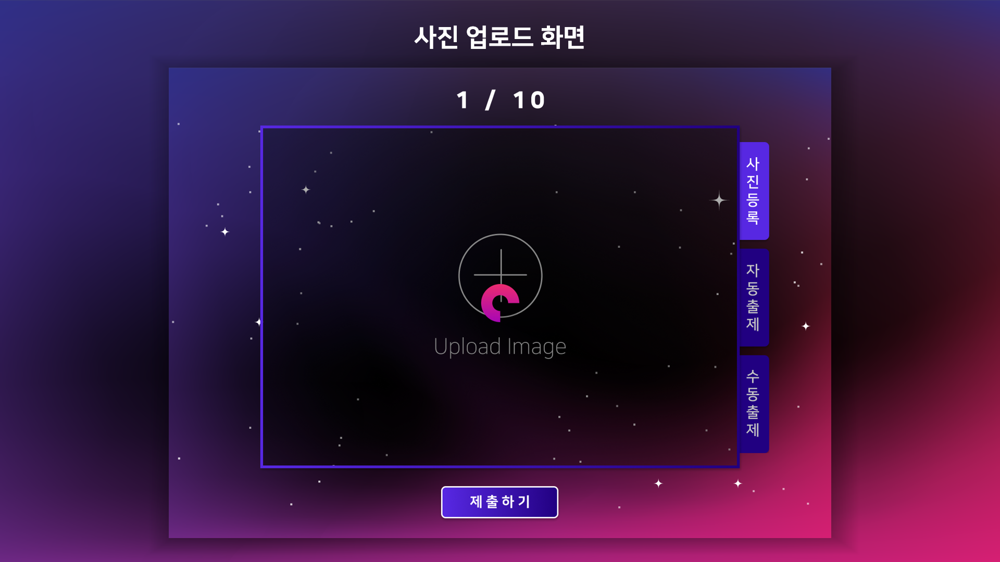
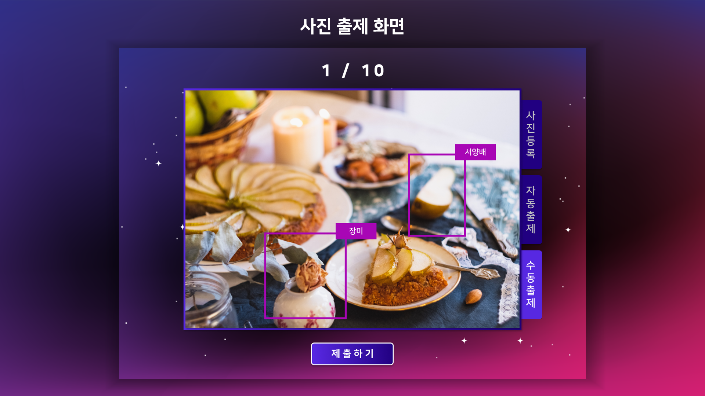
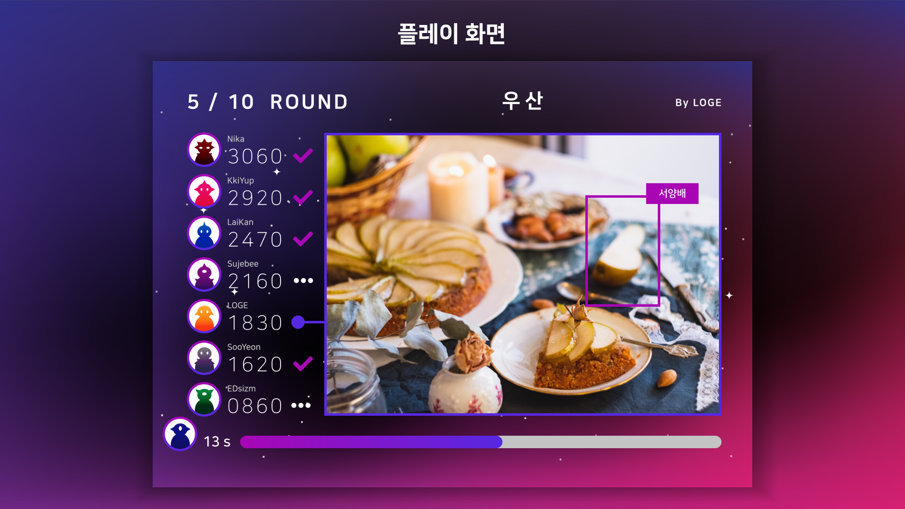
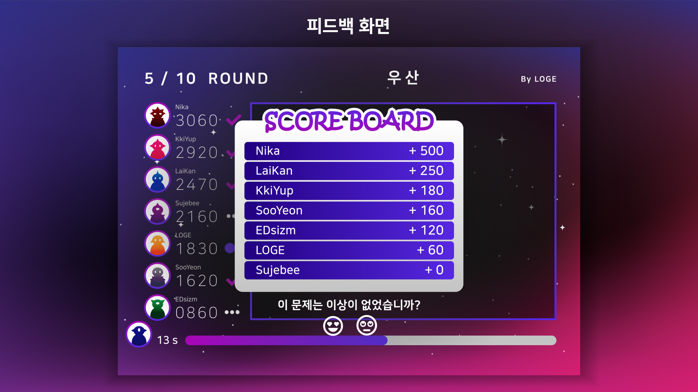
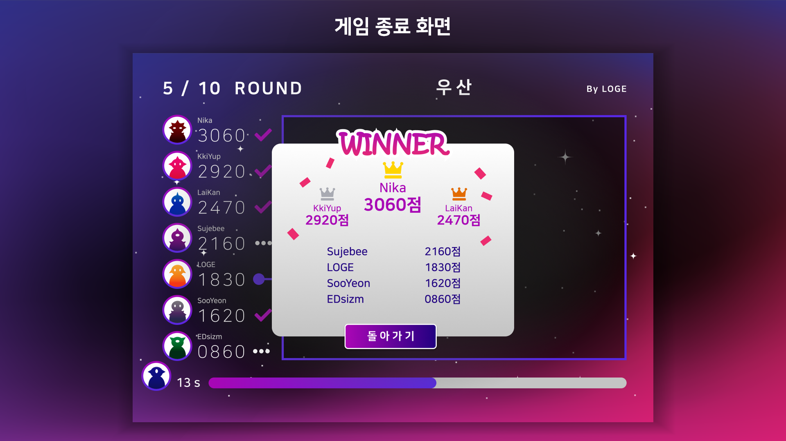

# Pictorial

## 팀명
**라떼즈**

## 팀원
- 심문성
- 김윤완
- 장정윤
- 서수연

## Pictorial이란?

Pictorial은 스피드 그림 찾기 멀티플레이 웹 게임입니다.

기존의 그림 찾기 게임과 달리 유저가 업로드한 이미지 안의 사물을 AI(Object Detection)가 자동으로 찾아서 문제를 생성합니다.

유저는 AI가 찾은 사물의 제시어를 바꿔 출제할 수도 있습니다. (미구현)

게임은 이렇게 진행됩니다.

유저는 이름을 입력해 방을 생성할 수 있고 방을 생성하면 초대링크가 주어집니다.

이 링크를 통해 다른 유저들이 게임에 참가할 수 있습니다.

게임이 시작되면 각 유저들은 자신이 문제로 출제하고 싶은 이미지를 업로드합니다.

그러면 서버에서 Object Detection API를 통해 각 업로드 된 이미지들을 분석한 뒤, 인식 데이터를 기반으로 문제를 생성합니다.

게임이 시작되면 현 라운드의 출제자가 업로드한 이미지에서 AI가 제시하는 물체를 주어진 시간 안에 다른 참가자들보다 먼저 찾아내야 합니다.

빠르게 정답을 찾아낼수록 더 높은 점수를 획득합니다.

게임이 끝나면 가장 높은 점수를 가진 참가자가 우승합니다.

## 목적

사람들이 플레이하면서 이미지를 업로드하고 제시어를 바꾸면서 AI가 학습할 만한 데이터를 수집할 수 있습니다.

* 이미지 정확도에 대한 사용자들의 피드백을 수집함으로서 이미지의 정확성을 높일 수 있습니다.

* 사용자가 직접 이미지 데이터를 레이블링 함으로써 한 객체를 표현하는 다양한 단어를 수집할 수 있습니다.

## 사용기술

- React
- Node.js, Express.js
- MySQL
- socket.io
- Object Detection API (네이버 클라우드 플랫폼 AI 서비스)

## 구성도

</img>

## 결과 이미지

실제 사이트와 약간 다를 수 있습니다.

</img>
</img>
</img>
</img>
</img>
</img>
</img>

## URI

https://pictorial.surge.sh/

서버가 닫혀있으면 실행이 안될 수 있습니다.
